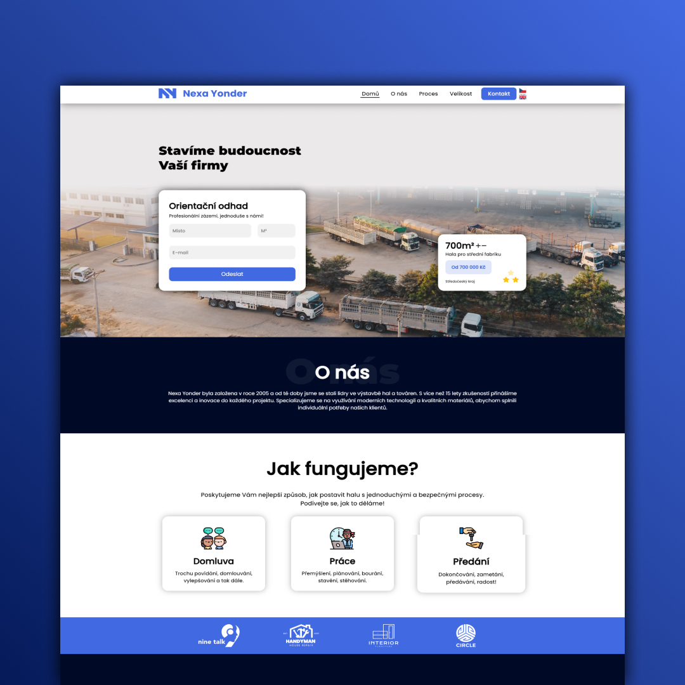
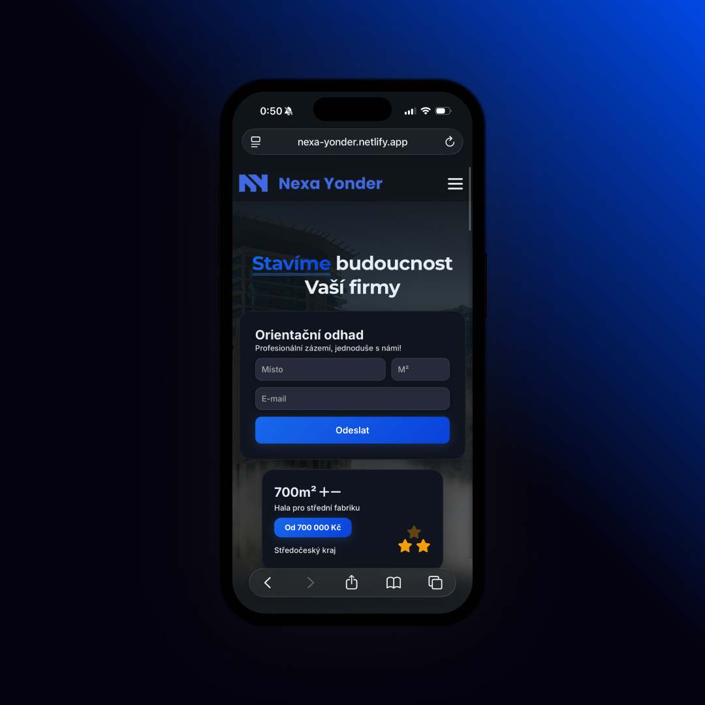

## 🏗️ Nexa Yonder
A modern and professional website for a construction company specializing in building halls and factories.
This website provides comprehensive information about company services, showcases their work process, and allows potential clients to get in touch easily.
The site features a bilingual interface (Czech/English) and responsive design for optimal viewing on all devices.

## 🚀 Features
• **Bilingual Support** – Switch between Czech and English with a single click. <br>
• **Responsive Design** – Fully optimized for desktop, tablet, and mobile devices. <br>
• **Smooth Animations** – Scroll reveal effects for enhanced user experience. <br>
• **Interactive Navigation** – Mobile-friendly burger menu with smooth transitions. <br>
• **Contact Form** – Easy-to-use form for client inquiries. <br>
• **Scroll to Top Button** – Quick navigation back to the top of the page. <br>
• **Modern UI/UX** – Clean and professional design with attention to detail. <br>
• **Loading Animation** – Smooth loader for better initial page experience. <br>

## 📱 Screenshots
 

## 🏃🏻 How to Run this App
1. Clone the repository: <br>
    • `git clone https://github.com/DejvCodes/Nexa-Yonder.git` <br>
    • `cd Nexa-Yonder` <br>
2. Open HTML file in your browser: <br>
    • open index.html in a live server or browser <br>
    • or use Live Server extension in VS Code <br>

## 💻 Tech Stack
[](https://skillicons.dev)

## 📁 Project Structure
```
JavaScript/
├── script.js            # Main JavaScript logic
├── langs.js             # Language translation system
└── scrollreveal.min.js  # Scroll animation library

css/
└── style.css            # Main stylesheet

img/                     # Images and assets
index.html               # Main HTML file
```

## 🌐 Live Demo
<a href="https://nexa-yonder.netlify.app/">Nexa Yonder</a>

## 🔐 License
[MIT License](LICENSE)